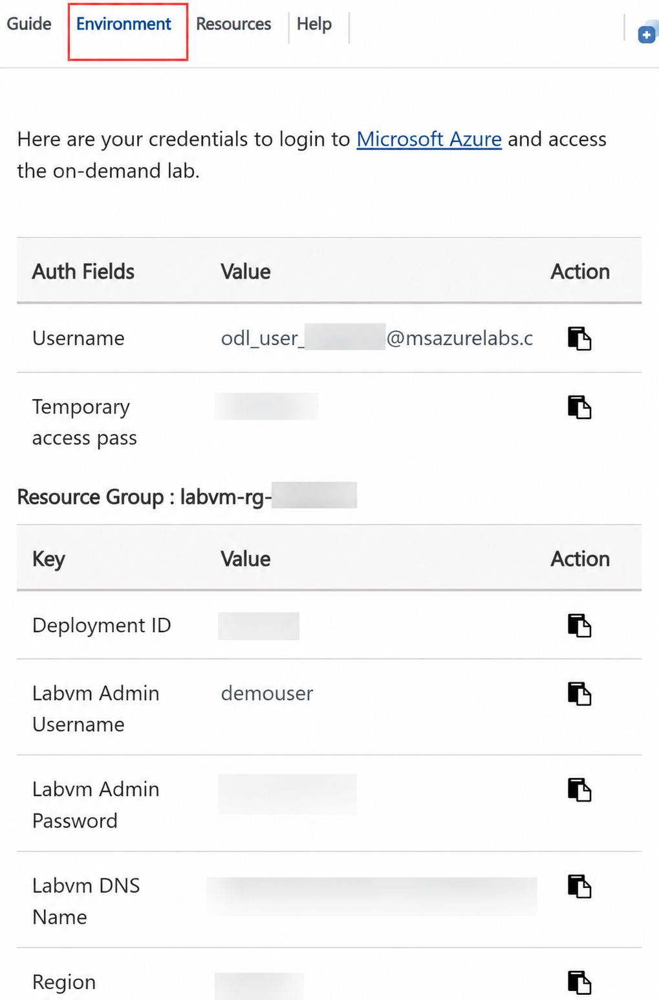

# Build Agentic AI with Semantic Kernel and GraphRAG on PostgreSQL 

### Overall Estimated Duration: 4 Hours

## Overview

Large Language Models (LLMs) enhance modern applications with advanced semantic capabilities, enabling natural language understanding and contextual search. This lab focuses on building an agent-driven Retrieval-Augmented Generation (RAG) application that explores a U.S. Case Law dataset to retrieve factual information. You’ll work with Azure Database for PostgreSQL, Visual Studio Code, and the Semantic Kernel Agent Framework, while applying practical AI and information retrieval techniques such as using vector embeddings within databases and implementing the DiskANN index for fast, high-dimensional vector search.

The lab begins by setting up a data environment and configuring Azure AI extensions before moving into text search using pattern matching. It then introduces semantic vector search, showing how vector indexes dramatically improve search accuracy and relevance. Building on this, the lab incorporates the GraphRAG pattern using Apache AGE, adding graph database functionality to PostgreSQL. This integration enables agents to query both structured and graph-based data, enriching results with interconnected knowledge extracted from relationships within the dataset.

## Objectives

By the end of this lab, you will be able to:

- **Lab 01 - Enable Intelligent Search in PostgreSQL with Vectors and DiskANN**: This lab establishes a PostgreSQL connection in VS Code, enables AI-driven semantic search using Azure OpenAI embeddings and DiskANN indexing, and integrates structured data with vector-based search for agent-based AI applications.

- **Lab 02 - Build a Semantic Kernel Agentic**: This lab involves building a Semantic Kernel Agentic app in a Python Jupyter Notebook using VS Code, enabling the agent to reason over a legal cases database, integrate external web data, and utilize memory for improved responses over time.

## Pre-requisites

Participants should have:

- Basic understanding of Azure services such as Azure OpenAI and models.
- Basic familiarity with PostgreSQL database concepts and operations.

## Architecture

This architecture represents an agent-driven application workflow designed to build an intelligent agent that retrieves knowledge graph information from a dataset and enriches it with AI-generated insights. Developers build and manage the app using Visual Studio Code and Jupyter Notebooks. User prompts are processed through the Semantic Kernel framework to generate vector embeddings and execute structured tools. These embeddings enable hybrid semantic searches through a PostgreSQL database extended with graph capabilities. Azure OpenAI enhances the retrieved data with contextual reasoning, while semantic re-ranking ensures the most relevant, connected information is presented to the user.

## Architecture Diagram

### Explanation of Components

- **Visual Studio Code & Jupyter Notebook:** Developer environments for building, testing, and managing AI agents, Semantic Kernel configurations, and code integrations.
- **Code Base:** Contains the agent logic, plugin definitions, AI workflows, and configurations that orchestrate interactions between Semantic Kernel, databases, and external APIs.
- **Meteo Weather Web Service:** Example of a real-world API that the agent can query via a Semantic Kernel plugin function, demonstrating tool usage within an agent’s reasoning workflow.
- **Semantic Kernel Agent / Tools Framework:** The orchestration layer managing AI agents that can respond to user prompts, decide which plugin functions to call, access databases/APIs, and combine LLM reasoning with real-world data for grounded, reliable answers.
- **Generate Embedding of User Prompt:** Converts user input into vector embeddings using Azure OpenAI, enabling high-dimensional semantic search capabilities within the database.
- **Hybrid Search based on Semantic Kernel Tool:** Performs both keyword-based and vector-based semantic searches, combining results for improved relevance using vector and graph indexes in PostgreSQL.
- **Azure OpenAI:** Provides LLM services for generating embeddings and AI chat completions, enabling agents to reason over retrieved data and produce contextually rich, coherent responses.
- **Semantic Re-ranking Cross Encoder:** Reorders retrieved results by evaluating their semantic similarity to the original user query, refining search output before generating the final AI response.
- **Azure PostgreSQL Graph & Relational Database:** Stores structured data alongside graph-based relationships using Apache AGE, enabling both relational queries and graph traversals for knowledge graph retrieval.
- **Azure AI Extension:** Extends PostgreSQL with vector search and DiskANN indexing, enabling fast, scalable, high-dimensional semantic search directly within the database.

## Getting Started with the lab

Welcome to your Build Agentic AI with Semantic Kernel and GraphRAG on PostgreSQL Workshop. Let's begin by making the most of this experience:

## Accessing Your Lab Environment

Once you're ready to dive in, your virtual machine and **Guide** will be right at your fingertips within your web browser.

> **Note:** **If you see a PowerShell window running, please minimize it after accessing the environment to ensure the script continues to run in the background without interruption.**

### Virtual Machine & Lab Guide

Your virtual machine is your workhorse throughout the workshop. The lab guide is your roadmap to success.

## Exploring Your Lab Resources

To get a better understanding of your lab resources and credentials, navigate to the **Environment** tab.

## Utilizing the Split Window Feature

For convenience, you can open the lab guide in a separate window by selecting the **Split Window** button from the top right corner.

## Managing Your Virtual Machine

Feel free to **Start, Stop, or Restart (2)** your virtual machine as needed from the **Resources (1)** tab. Your experience is in your hands!

## Lab Guide Zoom In/Zoom Out

To adjust the zoom level for the environment page, click the **A↕ : 100%** icon located next to the timer in the lab environment.

## Let's Get Started with Azure Portal

1. On your virtual machine, click on the Azure Portal icon.

   

2. On the **Sign in to Microsoft Azure** tab, enter the following **email/username (1)**, and click on **Next (2)**. 

   - **Email/Username:** <inject key="AzureAdUserEmail"></inject>

     

3. Now enter the following **Temporary Access Pass (1)** and click on **Sign in (2)**.

   - **Temporary Access Pass:** <inject key="AzureAdUserPassword"></inject>

     

4. If prompted to **stay signed in**, you can click **No**.

   

## Support Contact

The CloudLabs support team is available 24/7, 365 days a year, via email and live chat to ensure seamless assistance at any time. We offer dedicated support channels tailored specifically for both learners and instructors, ensuring that all your needs are promptly and efficiently addressed.

Learner Support Contacts:

- Email Support: [cloudlabs-support@spektrasystems.com](mailto:cloudlabs-support@spektrasystems.com)
- Live Chat Support: https://cloudlabs.ai/labs-support

Click **Next >>** from the bottom right corner to embark on your Lab journey!

Now you're all set to explore the powerful world of technology. Feel free to reach out if you have any questions along the way. Enjoy your workshop!

## Happy Learning!!
